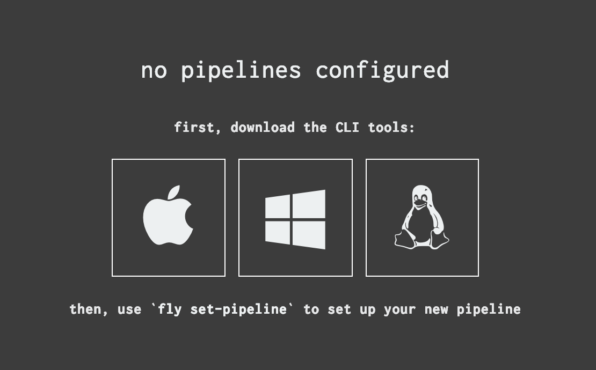

# Writing a Pipeline to Upgrade an Existing Ops Manager

## Greetings! (and Prerequisites)

Hello, Platform Automator!

Over the course of this guide,
we're going to create a [Concourse] [Pipeline][concourse-pipeline]
using Platform Automation for PCF.

Before we get started, you'll need a few things ready to go:

1. a running Ops Manager VM that you would like to upgrade
1. a Concourse instance
   with access to a Credhub instance
   and to the Internet
1. github.com account
1. Credentials for S3
1. an account on [https://network.pivotal.io](https://network.pivotal.io) (Pivnet)
1. a MacOS workstation
    - with Docker installed
    - and a text editor you like
    - a terminal emulator you like
    - a browser that works with Concourse,
      like Firefox or Chrome
    - and `git`

It will be very helpful to have a basic familiarity with the following:

- the bash terminal
- git
- YAML
- Concourse

But if you don't have basic familiarity with all these things,
that's okay, though this may go a little harder.
We'll explain some basic stuff,
and link to resources to learn more.

!!! info "A note on the prerequisites"
    While this guide uses github to provide a git remote,
    and an S3 bucket as a blob-store,
    Platform Automation supports arbitary git providers
    and S3-compatable blob-stores.
    If you need to use an alternate one,
    that's okay!
    We picked specific examples
    so we could describe some steps in detail.
    Some details may be different
    if you follow along with different providers.
    If you're comfortable navigating those differences on your own,
    go for it!
    Similarly, in this guide, we assume the MacOS operating system.
    This should all work fine on Linux, too,
    but there might be differences in the paths you'll need to figure out.

## Creating a Concourse Pipeline

Platform Automation's tasks and image are meant to be used in a Concourse Pipeline.
So, let's make one.

Using your trusty bash command line client,
create a directory to keep your pipeline files in, and `cd` into it.

```bash
mkdir platform-automation-pipelines
cd !$
```

!!! tip ""`!$`" ????"
    `!$` is a bash shortcut.
    Pronounced "bang, dollarsign,"
    it means "use the last argument from the most recent command."
    In this case, that's the directory we just created!
    This is not a Platform Automation thing,
    this is just a bash tip dearly beloved
    of at least one Platform Automator.

Using your text editor, create a file called `upgrade-ops-man-pipeline.yml`.

Write this at the top, and save the file:

```yaml
---
```

This is [YAML](https://learnxinyminutes.com/docs/yaml/) for "the start of the document."
It's optional, but traditional.

Now you have a pipeline file! Nominally!
Well, look.
It's valid YAML, at least.

### Getting `fly`

Let's try to set it as a pipeline with `fly`,
the Concourse Command Line Interface (CLI).

First, check if we've got `fly` installed at all:

```bash
fly -v
```

If it gives you back a version number, great!
Skip ahead to [Setting The Pipeline][]

If it says something like `-bash: fly: command not found`,
we have a little work to do; we've got to get `fly`.

Navigate to the address for your Concourse instance in a web browser.
At this point, you don't even need to be signed in!
If there are no public pipelines, you should see something like this:



If there _are_ public pipelines,
or if you're signed in and there are pipelines you can see,
you'll see something similar in the lower-right hand corner.

Click the icon for your OS and save the file,
`mv` the resulting file to somewhere in your `$PATH`,
and use `chmod` to make it executable:

```bash
mv ~/Downloads/fly /usr/local/bin/fly
chmod +x !$
```

Congrats! You got `fly`.

!!! info "Okay but what did I just do?"
    FAIR QUESTION. You downloaded the `fly` binary,
    moved it into bash's PATH,
    which is where bash looks for things to execute
    when you type a command,
    and then added permissions that allow it to be e`x`ecuted.
    Now, the CLI is installed -
    and we won't have to do all that again,
    because `fly` has the ability to update itself,
    which we'll get into later.

### Setting The Pipeline

Okay _now_ let's try to set our pipeline with `fly`, the Concourse CLI.

`fly` keeps a list of Concourses it knows how to talk to.
Let's see if the concourse we want is already on the list:

```bash
fly targets
```

If you see the address of the Concourse you want to use in the list,
note down its name, and use it in the login command:

```bash
fly -t control-plane login
```

!!! info "control-plane?"
    We're going to use the name `control-plane`
    for our Concourse in this guide.
    It's not a special name,
    it just happens to be the name
    of the Concourse we want to use in our target list.

If you don't see the Concourse you need, you can add it with the `-c` flag:

```bash
fly -t control-plane login -c https://example.com/your-concourse-url
```

You should see a login link you can click on
to complete login from your browser.

!!! tip "Stay on Target"
    The `-t` flag sets the name when used with `login` and `-c`.
    In the future, you can leave out the `-c` argument.

Either way, pipeline-setting time!

```bash
fly -t control-plane set-pipeline -p upgrade-ops-manager -c upgrade-ops-man-pipeline.yml
```

It should say `no changes to apply`,
which is fair, since we gave it an empty YAML doc.

!!! info "version discrepancy"
    If `fly` says something about a "version discrepency,"
    "significant" or otherwise, just do as it says:
    run `fly sync` and try again.
    `fly sync` automatically updates the CLI
    with the version that matches the Concourse you're targeting.
    Useful!

### Your First Job

Let's see Concourse actually _do_ something, yeah?

Add this to your `upgrade-ops-man-pipeline.yml`, starting on the line after the `---`:

```yaml
wait: no nevermind let's get version control first
```

Good point. Don't actually add that to your pipeline config yet.
Or if you have, delete it, so your whole pipeline looks like this again:

```yaml
---
```

Reverting edits to our pipeline is something we'll probably want to do again.
This is one of many reasons we want to keep our pipeline under version control.

So let's make this directory a git repo!

#### But First, `git init`

```bash
git init
git commit --allow-empty -m "Empty initial commit"
```

`git` should come back with information about the commit you just created.

If it gives you a config error instead,
you might need to configure `git` a bit.
Here's a [good guide](https://git-scm.com/book/en/v2/Getting-Started-First-Time-Git-Setup)
to initial setup.
Get that done, and try again.

Now we can add our `upgrade-ops-man-pipeline.yml`,
so in the future it's easy to get back to that soothing `---` state.

```bash
git add upgrade-ops-man-pipeline.yml
git commit -m "Add empty upgrade-ops-man-pipeline"
```

Let's just make sure we're all tidy:

```bash
git status
```

`git` should come back with `nothing to commit, working tree clean`.

Great. Now we can safely make changes.

!!! tip "Git Commits"
    `git` commits are the basic unit of code history.
    Making frequent, small, commits with good commit messages
    makes it _much easier_ to figure out why things are the way they are,
    and to return to the way things were in simpler, better times.
    Writing short commit messages that capture the _intent_ of the change
    (in an imparative style) can be tough,
    but it really does make the pipeline's history much more legible,
    both to future-you,
    and to current-and-future teammates and collaborators.

#### The Test Task

Platform Automation comes with a [`test`](../reference/task.md#test) task
meant to validate that it's been installed correctly.
Let's use it to get setup.

Add this to your `upgrade-ops-man-pipeline.yml`, starting on the line after the `---`:

```yaml
jobs:
- name: test
  plan:
    - task: test
      image: platform-automation-image
      file: platform-automation-tasks/tasks/test.yml
```

If we try to set this now, Concourse will take it:

```bash
fly -t control-plane set-pipeline -p upgrade-ops-manager -c upgrade-ops-man-pipeline.yml
```

Now we should be able to see our `upgrade-ops-manager` pipeline
in the Concourse UI.
It'll be paused, so click the "play" button to unpause it.
Then, click in to the gray box for our `test` job,
and hit the "plus" button to schedule a build.

It should error immediately, with `unknown artifact source: platform-automation-tasks`.
We didn't give it a source for our task file.

We've got a bit of pipeline code that Concourse accepts.
Before we start doing the next part,
this would be a good moment to make a commit:

```bash
git add upgrade-ops-man-pipeline.yml
git commit -m "Add (nonfunctional) test task"
```

With that done,
we can try to get the inputs we need
by adding `get` steps to the plan
before the task, like so:

```yaml
jobs:
- name: test
  plan:
    - get: platform-automation-image
      resource: platform-automation
      params:
        globs: ["*image*.tgz"]
        unpack: true
    - get: platform-automation-tasks
      resource: platform-automation
      params:
        globs: ["*tasks*.zip"]
        unpack: true
    - task: test
      image: platform-automation-image
      file: platform-automation-tasks/tasks/test.yml
```

If we try to `fly set` this,
`fly` will complain about invalid resources.

To actually make the `image` and `file` we want to use available,
we'll need some Resources.

#### Adding Resources
Resources are Concourse's main approach to managing artifacts.
We need an image, and the tasks directory -
so we'll tell Concourse how to get these things by declaring Resources for them.

In this case, we'll be downloading them from Pivnet.
Before we can declare the resources themselves,
we have to teach Concourse to talk to Pivnet.
(Many resource types are built in, but this one isn't.)

Add the following to your pipeline file.
We'll put it above the `jobs` entry.

```yaml
resource_types:
- name: pivnet
  type: docker-image
  source:
    repository: pivotalcf/pivnet-resource
    tag: latest-final
resources:
- name: platform-automation
  type: pivnet
  source:
    product_slug: platform-automation
    api_token: ((pivnet-refresh-token))
```

The API token is a credential,
which we'll pass via the command-line when setting the pipeline,
so we don't accidentally check it in.

Grab a refresh token from your [Pivnet profile](https://network.pivotal.io/users/dashboard/edit-profile)
and clicking "Request New Refresh Token."
Then use that token in the following command:

```bash
fly -t control-plane set-pipeline \
    -p upgrade-ops-manager \
    -c upgrade-ops-man-pipeline.yml \
    -v pivnet-refresh-token=your-api-token
```

!!! warning Getting Your Pivnet Token Expires It
    When you get your Pivnet token as described above,
    any previous Pivnet tokens you may have gotten will stop working.
    If you're using your Pivnet refresh token anywhere,
    retrieve it from your existing secret storage rather than getting a new one,
    or you'll end up needing to update it everywhere it's used.

Go back to the Concourse UI and trigger another build.
This time, it should pass.

Commit time!

```bash
git add upgrade-ops-man-pipeline.yml
git commit -m "Add resources needed for test task"
```

#### Exporting The Installation
We're finally in a position to do work!

While ultimately we want to upgrade Ops Manager,
to do that safely we first need to download and persist
an export of the current installation.

!!! warning "export your installation routinely"
    We _**strongly recommend**_ automatically exporting
    the Ops Manager installation
    and persisting it to your blobstore on a regular basis.

Let's switch out the test job
for one that exports our existing Ops Manager's installation state.
We can switch the task out by changing:
- the `name` of the job
- the `name` of the task
- the `file` of the task

[`export-installation`](../reference/task.md#export-installation)
has an additional required input.
We need the `env` file used to talk to Ops Manager.

We'll write that file and make it available as a resource in a moment,
for now, we'll just `get` it as if it's there.

It also has an additional output (the exported installation).
Again, for now, we'll just write that
like we have somewhere to `put` it.

```yaml
jobs:
- name: export-installation
  plan:
    - get: platform-automation-image
      resource: platform-automation
      params:
        globs: ["*image*.tgz"]
        unpack: true
    - get: platform-automation-tasks
      resource: platform-automation
      params:
        globs: ["*tasks*.zip"]
        unpack: true
    - get: env
    - task: export-installation
      image: platform-automation-image
      file: platform-automation-tasks/tasks/export-installation.yml
    - put: installation
      params:
        file: installation/installation-*.zip
```

If we try to `fly` this up to Concourse,
it will again complain about resources that don't exist.

So, let's make them.

The first new resource we need is the env file.
We'll push our git repo to a remote on Github
to make this (and later, other) configuration available to the pipelines.

Github has good [instructions](https://help.github.com/en/articles/adding-an-existing-project-to-github-using-the-command-line)
you can follow to create a new repository on Github.
You can skip over the part
about using `git init` to setup your repo,
since we [already did that](#but-first-git-init).

Once you've setup your remote
and used `git push` to send what you've got so far,
we can add a new directory to hold foundation-specific configuration.
(We'll use the name "foundation" for this directory,
but if your foundation has an actual name, use that instead.)

```bash
mkdir -p foundation
cd !$
```

`env.yml` holds authentication and target information
for a particular Ops Manager.

An example `env.yml` is shown below.
As mentioned in the comment,
`decryption-passphrase` is required for `import-installation`,
and therefore required for `upgrade-opsman`.

If your foundation uses authentication other than basic auth,
please reference [Inputs and Outputs][env]
for more detail on UAA-based authentication.

Write an `env.yml` for your Ops Manager.




#### Fetching the New Ops Manager

#### On Triggers

#### Upgrading Ops Manager

### Wait, Is That All?

Yes, for now.
You can do a lot more with Platform Automation,
but your Ops Manager is now safely upgraded to a new version.

Great work!


    



